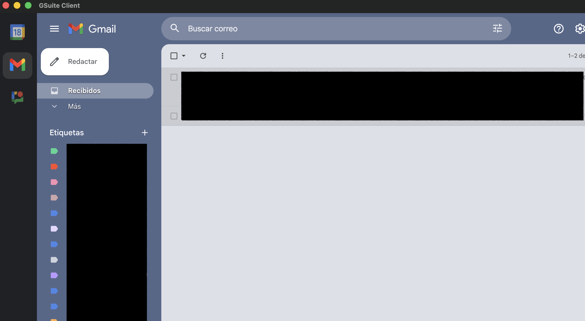

# GSuite & Proton Desktop Client

[](https://app.codacy.com/gh/apenlor/electron-gsuite-client/dashboard?utm_source=gh&utm_medium=referral&utm_content=&utm_campaign=Badge_grade)
[](https://github.com/apenlor/electron-gsuite-client/actions)
[](https://github.com/apenlor/electron-gsuite-client/releases/latest)

A native, cross-platform desktop client for Google Workspace (Gmail, Calendar, Chat, Tasks, Drive) and Proton (Mail, Calendar), consolidating them into a single, seamless application. Built with Electron **(just for fun)**


_The application running on macOS, showing the Gmail view._

---

## Features

- **Unified Interface:** Access Google Workspace and Proton services from a single, clean side-menu.
- **Customizable Workspace:** Right-click the sidebar to enable or disable specific services. Settings are persisted automatically.
- **Privacy First:** Proton services run in a dedicated, isolated session partition (`persist:proton`), ensuring zero data sharing with Google services.
- **Native OS Integration:**
  - Dock/Taskbar badge for a combined total of unread message counts.
  - Native OS notifications for all services (browser-native strategy).
  - Standard application menu (`File`, `Edit`, `View`) with familiar keyboard shortcuts (`Cmd/Ctrl+R` for Reload, etc.).
- **Dynamic UI:** The menu icons dynamically update to reflect the real-time status of each service by proxying the official favicons.
- **State Persistence:** Remembers your window size, position, active tab, and enabled services between sessions.
- **Security Hardened:** All third-party web content is run in a sandboxed process, with strict permission handling and a secure IPC bridge.

## Installation

You can download the latest version for your operating system from the [**Releases Page**](https://github.com/apenlor/electron-gsuite-client/releases/latest).

- **macOS:** Download the `.dmg` file.
- **Windows:** Download the `Setup.exe` file.
- **Linux:** Download the `.AppImage` file.

_Note: The application is currently unsigned. Your OS may show a security warning upon first launch. This is expected and can be bypassed (e.g., by right-clicking > Open on macOS)._

## Development

### Prerequisites

- Node.js (`>=20.0.0` as defined in `package.json`)
- npm (v9 or later recommended)

### Getting Started

1.  **Clone the repository:**

    ```bash
    git clone https://github.com/apenlor/electron-gsuite-client.git
    cd electron-gsuite-client
    ```

2.  **Install dependencies:**
    This project uses `npm` for package management. The `ci` command is recommended for a clean install based on the lockfile.

    ```bash
    npm ci
    ```

3.  **Run the application in development mode:**
    This will launch the application with access to developer tools.
    ```bash
    npm start
    ```

### Key Scripts

- `npm start`: Runs the app in development mode.
- `npm run lint`: Lints the codebase for errors and style issues.
- `npm run format`: Formats all code using Prettier.
- `npm run build`: Builds the application for your current OS into the `/release` directory.
  - `npm run build:mac`
  - `npm run build:win`
  - `npm run build:linux`

## Architectural Overview

This application is built with configuration-driven Electron architecture.

- **Main Process (`main.js`):** A single `MainWindow` class manages the application lifecycle, window state, and all `BrowserView`s. The views are generated dynamically based on a combination of the static `VIEW_CONFIG` and the user's persistent preferences (via `electron-store`).
- **Preload Scripts (`preload.js`, `preload-web.js`):** These act as a secure bridge between the isolated renderer processes and the Node.js environment. They use `contextBridge` to expose a minimal, secure API contract, preventing renderer processes from accessing Node.js directly.
- **Security Model:** All third-party web content is rendered in `sandbox: true` `BrowserView`s with `contextIsolation` enabled. A minimal set of header modifications is performed to ensure functionality while maintaining a strong security posture. All IPC communication is validated against whitelists to prevent object injection vulnerabilities.
- **CI/CD:** An automated GitHub Actions workflow validates, builds, and publishes the application for all three major platforms upon the push of a version tag, enabling automated releases and auto-updates.

## License

This project is licensed under the [MIT License](LICENSE).
